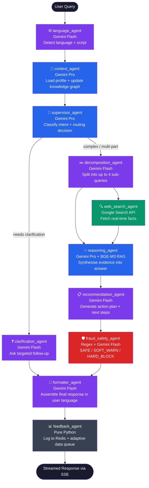
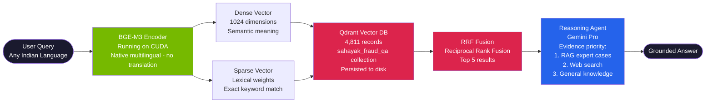
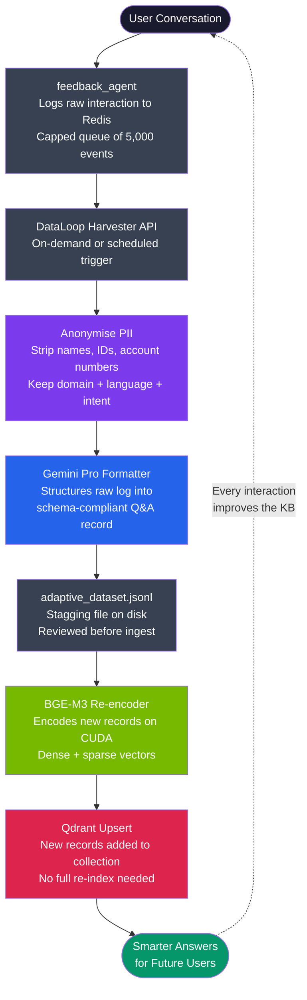
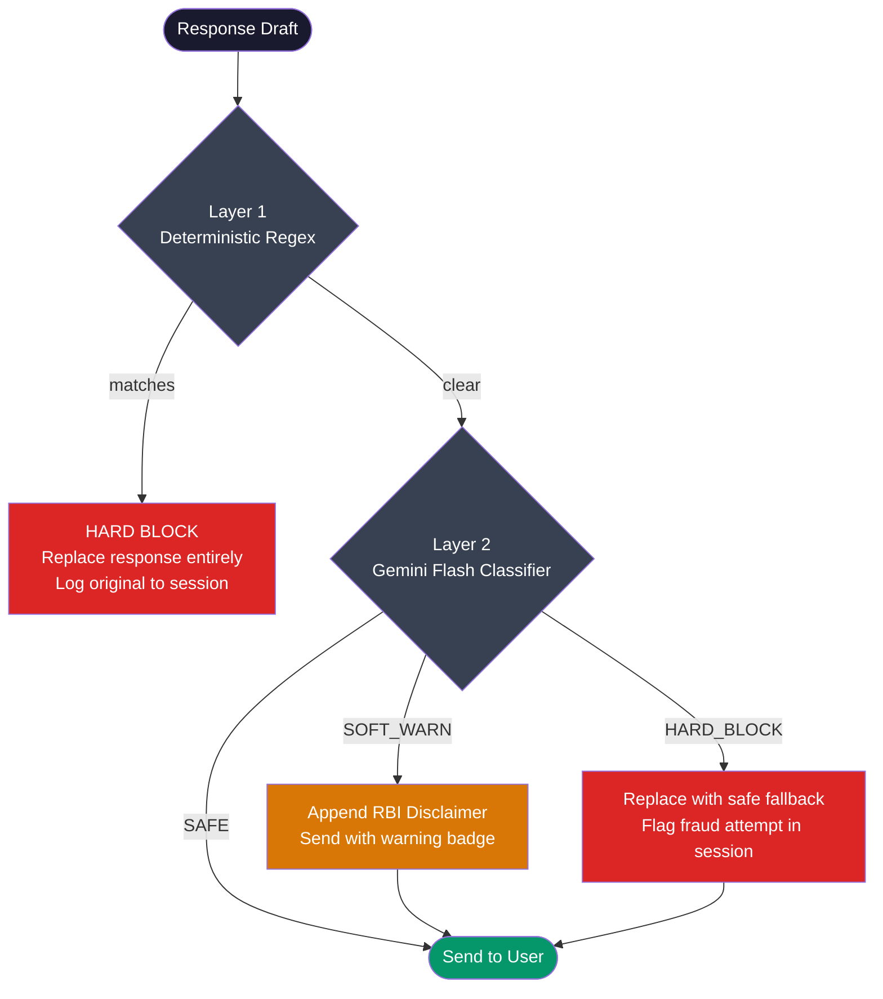

# Sahayak AI - Financial Inclusion for Rural India

> *"Sahayak" means helper in Hindi. We built an AI that speaks your language, knows your schemes, and protects you from fraud - whether you're a farmer in UP or a shopkeeper in Tamil Nadu.*

---

## Tech Stack


---

## The Problem

India has made remarkable progress - **559.8 million Jan-Dhan accounts**, 80% banking penetration. But access is not the same as understanding.

- Only **27% of Indian adults are truly financially literate**
- Rural and low-income groups still rely on cash, missing out on subsidies, insurance, and safe digital payments
- Scams targeting rural users (fake loan apps, UPI fraud, lottery schemes) cost billions yearly
- Government schemes worth **3+ lakh crore rupees** go unclaimed every year because people do not know they are eligible

**The gap is not access. It is knowledge - and language.**

A farmer in Maharashtra asking about PM-KISAN in Marathi deserves the same quality of financial guidance as a city professional googling in English. Sahayak AI is that bridge.

---

## What We Built

A **production-grade, multilingual, multi-agent AI assistant** that:

- Understands queries in **11+ Indian languages** including Hindi, Marathi, Tamil, Telugu, Bengali, Gujarati, Kannada, Malayalam, Punjabi, Urdu, and English - including code-switching
- Runs a **11-node LangGraph reasoning pipeline** with live agent-by-agent streaming
- Retrieves answers from a **4,811-record knowledge base** of real financial fraud Q&A using hybrid BGE-M3 + Qdrant vector search
- Identifies **eligible government schemes**, **required documents**, **complaint pathways**, and **active fraud alerts** all in parallel from a single chat message
- Continuously **grows its own dataset** via an adaptive data loop that logs, anonymises, and re-ingests every user interaction
- Builds a **personal knowledge graph** per user, tracking financial literacy across 6 domains and adapting responses to their level

---

## Live Demo Flow

```
User types: "मुझे PM किसान योजना के लिए क्या दस्तावेज़ चाहिए?"

              Sahayak AI Pipeline fires 11 agents in sequence
              Each streams its status live to the right-hand panel

                    +----------------------------------+
    Query --------> | language   -> Hindi detected     |
                    | context    -> Farmer profile      |
                    | supervisor -> route to decompose  |
                    | decompose  -> 2 sub-queries       |
                    | web_search -> latest RBI rules    |
                    | reasoning  -> RAG + synthesis     |
                    | recommend  -> next steps          |
                    | safety     -> fraud check         |
                    | formatter  -> clean Hindi answer  |
                    | feedback   -> log to Redis        |
                    +----------------------------------+
                                  |
                    +-------------+-------------+
                    |                           |
             Chat Answer               Explore Panel
           (streamed live)       +---------------------+
                                 | Eligible Schemes (3) |
                                 | Documents (7)        |
                                 | File Complaint       |
                                 | Fraud Alerts         |
                                 +---------------------+
```

---

## Architecture

### The 11-Agent LangGraph Pipeline



### RAG System - BGE-M3 + Qdrant Hybrid Search



### Adaptive Data Loop



### Safety Architecture



---

## Features

### Chat with Live Agent Pipeline
- Stream-based SSE responses - words appear as they are generated
- Right-hand panel shows each of the 11 agents lighting up in real time with latency timings
- Handles Hindi, Marathi, Tamil, Telugu, Bengali, Gujarati, Kannada, Malayalam, Punjabi, Urdu, English
- Code-switch aware - "mera UPI kyun band ho gaya" is understood perfectly
- Session-level conversation memory via Redis (24h TTL)

### Integrated Parallel Pipeline (Explore Further)
When you send a chat message, Sahayak simultaneously:
1. Streams the main AI answer
2. After the response lands, fires parallel API calls based on **intent detection**
3. Attaches contextual deep-link buttons to every AI bubble

| Button | What it does |
|--------|-------------|
| Eligible Schemes (N) | Shows which government schemes you qualify for |
| Document Checklist (N) | Lists exactly what paperwork you need |
| File Complaint | Guides you to the right grievance authority |
| Fraud Alerts | Shows active scam warnings relevant to your query |
| Similar Questions | RAG results - what others asked in similar situations |

Click any button and navigate to that feature page with data **pre-loaded**. No re-fetching, no switching tabs manually.

### Personal Knowledge Graph
Each user gets a persistent literacy profile across 6 domains:
- **Banking and Accounts** - UPI, savings, loans
- **Insurance** - PMSBY, PMJJBY, crop insurance
- **Government Schemes** - PMJDY, PM-KISAN, MGNREGA
- **Digital Payments** - UPI safety, mobile wallets
- **Fraud Awareness** - scam recognition, reporting
- **Investment Basics** - SIP, FD, mutual funds

The graph updates after every conversation. Beginner users get simpler explanations; advanced users get technical depth - automatically.

### Benefits Hub
- **Scheme Eligibility** - enter your profile, get a list of schemes you qualify for with eligibility breakdown
- **Document Checklist** - describe what you need to apply for; get a precise list of required documents
- **Complaint Guide** - describe your issue; get routed to the right authority (RBI, SEBI, local consumer forum, cyber crime portal)
- **Fraud Alert Feed** - live feed of active scam warnings, filterable by type

### RAG Pipeline Test Page
- Direct interface to the BGE-M3 + Qdrant retrieval system
- See similarity scores, domain categories, and suggested actions per result
- 4,811 expert Q&A records covering financial fraud in 7 Indian scripts
- Hybrid RRF fusion outperforms pure dense or pure sparse search

### Data Loop Panel
- View raw interaction events queued in Redis
- Trigger the anonymisation + Gemini formatting pipeline on demand
- Download the staged JSONL for human review before re-ingesting
- One-click re-ingest to push new examples into Qdrant

### Onboarding and Profile System
- 3-step profile creation (name, location/occupation, language preference)
- Adaptive questionnaire (12-15 questions) to assess baseline literacy
- Knowledge graph generated from questionnaire answers
- Profiles stored in Redis (7-day TTL) with Set-indexed listing for reliable retrieval
- Profile switcher in the top bar - switch users without re-onboarding

---

## The Dataset - Powered by Adaption

The knowledge base powering Sahayak was built in partnership with **[Adaption](https://adaptionlabs.ai)**, a platform for multilingual dataset processing, enrichment, and localisation.

Starting from raw financial Q&A data, Adaption's pipelines performed:
- **Prompt enhancement** - reformulated raw queries into natural, colloquial expressions per language
- **Completion enrichment** - expanded terse answers into detailed expert guidance with step-by-step actions
- **Cultural localisation** - adapted financial terminology and examples to regional context (a UPI warning reads differently for a Bihar farmer vs a Bangalore professional)
- **Multilingual generation** - produced native-script versions across 7 Indian scripts, not just translations

The result is **4,811 expert-curated records** across **5 financial domains**:

| Domain | Records | Key Subdomains |
|--------|---------|---------------|
| Banking and Digital Payments | 1,498 | UPI Fraud, Transaction Failures, KYC, Account Security, International Payments |
| Fraud and Cyber Safety | 1,463 | UPI Fraud Prevention, Fake Scheme Apps, Money Muling, Phishing |
| Savings and Insurance | 1,214 | PMFBY, PMJJBY, PMSBY, Health Insurance, Post Office Savings |
| Credit and Borrowing | 545 | Fake Loan Apps, Microfinance, Agricultural Credit |
| Government Schemes | 62 | PM-KISAN, PMJDY, MGNREGA eligibility and enrollment |

**Language distribution across the corpus:**

| Script | Language(s) | Records |
|--------|------------|---------|
| Devanagari | Hindi + Marathi | 2,225 |
| English | English | 980 |
| Tamil | Tamil | 322 |
| Gujarati | Gujarati | 320 |
| Kannada | Kannada | 319 |
| Telugu | Telugu | 318 |
| Malayalam | Malayalam | 318 |

### Adaption-Processed Datasets on Kaggle

All domain datasets are publicly available - processed, enriched, and localised by Adaption:

| Dataset | Link |
|---------|------|
| Banking and Digital Payments | [kaggle.com/datasets/shivamsiddhant/adaption-banking-and-digital-payments](https://www.kaggle.com/datasets/shivamsiddhant/adaption-banking-and-digital-payments) |
| Fraud and Cyber Safety | [kaggle.com/datasets/shivamsiddhant/adaption-fraud-and-cyber-safety](https://www.kaggle.com/datasets/shivamsiddhant/adaption-fraud-and-cyber-safety/data) |
| Savings and Insurance | [kaggle.com/datasets/shivamsiddhant/adaption-savings-and-insurance](https://www.kaggle.com/datasets/shivamsiddhant/adaption-savings-and-insurance/data) |
| Government Schemes | [kaggle.com/datasets/shivamsiddhant/adaption-government-schemes](https://www.kaggle.com/datasets/shivamsiddhant/adaption-government-schemes/data) |
| Credit and Borrowing | [kaggle.com/datasets/shivamsiddhant/adaption-cred-8334af06-3653-4ab8-bdbc-b6521cd73328](https://www.kaggle.com/datasets/shivamsiddhant/adaption-cred-8334af06-3653-4ab8-bdbc-b6521cd73328) |
| **Master Dataset (all domains)** | [kaggle.com/datasets/shivamsiddhant/adaption-financial-inclusion-in-india](https://www.kaggle.com/datasets/shivamsiddhant/adaption-financial-inclusion-in-india/data) |

> Adaption's enrichment pipeline produced an average 82% improvement in data quality per record - turning short, ambiguous raw answers into detailed, actionable guidance in the user's native script.

---

## Tech Stack

| Layer | Technology | Purpose |
|-------|-----------|---------|
| LLM (reasoning) | Google Gemini 2.5 Pro | Complex reasoning, context extraction, supervision |
| LLM (fast agents) | Google Gemini 2.5 Flash | Language detection, formatting, safety, clarification |
| Orchestration | LangGraph | Stateful 11-node directed agent graph with conditional routing |
| Backend | FastAPI | Async API, SSE streaming, REST endpoints |
| Embeddings | BGE-M3 (BAAI) on CUDA | Multilingual dense + sparse encoding, no translation needed |
| Vector DB | Qdrant (Docker) | Hybrid RRF search, persistent bind-mount storage |
| Cache / State | Redis 7 (Docker) | Session store, profile store, Set-indexed listing, interaction queue |
| Web Search | Google Custom Search API | Real-time facts, prices, policy updates |
| Frontend | React 18 | SPA with SSE stream parsing, always-mounted chat panel |
| Dataset Partner | Adaption | Multilingual enrichment, localisation, prompt + completion enhancement |
| Cloud | Google Vertex AI | Gemini API hosting via Application Default Credentials |

---

## Project Structure

```
financial-inclusion/
+-- fulli.jsonl                       # 4,811-record master knowledge base
+-- backend/
|   +-- main.py                       # FastAPI app, SSE /chat endpoint
|   +-- config.py                     # All settings (Pydantic BaseSettings)
|   +-- requirements.txt
|   +-- agents/
|   |   +-- language_agent.py         # Gemini Flash - detect lang/script
|   |   +-- context_agent.py          # Gemini Pro - profile + KG update
|   |   +-- supervisor_agent.py       # Gemini Pro - routing brain
|   |   +-- clarification_agent.py    # Gemini Flash - ask follow-ups
|   |   +-- decomposition_agent.py    # Gemini Flash - split complex queries
|   |   +-- web_search_agent.py       # Google Search - no LLM
|   |   +-- reasoning_agent.py        # Gemini Pro - RAG + web synthesis
|   |   +-- recommendation_agent.py   # Gemini Flash - action plan
|   |   +-- fraud_safety_agent.py     # Regex + Gemini Flash - safety filter
|   |   +-- formatter_agent.py        # Gemini Flash - final response
|   |   +-- feedback_agent.py         # Pure Python - Redis logging
|   +-- graph/
|   |   +-- state.py                  # AgentState TypedDict
|   |   +-- graph_builder.py          # LangGraph assembly + conditional edges
|   |   +-- router.py                 # Routing logic
|   +-- memory/
|   |   +-- session_store.py          # Redis helpers (session, profile, feedback)
|   +-- rag/
|   |   +-- bge_retriever.py          # BGE-M3 encode + Qdrant hybrid search
|   |   +-- ingest_bge.py             # Index JSONL into Qdrant
|   |   +-- rag_router.py             # /rag/* FastAPI routes
|   +-- routers/
|   |   +-- profiles.py               # /profiles/* endpoints
|   |   +-- schemes.py                # /schemes/eligible
|   |   +-- documents.py              # /documents/checklist
|   |   +-- complaints.py             # /complaints/guide
|   |   +-- fraud.py                  # /fraud/alerts
|   +-- utils/
|       +-- logger.py                 # Structured JSON logger
+-- frontend/
    +-- src/
        +-- App.jsx                   # Root - always-mounted chat, tab routing
        +-- components/
        |   +-- ChatWindow.jsx         # SSE stream + intent detection + parallel calls
        |   +-- MessageBubble.jsx      # Explore Further panel with deep-link buttons
        |   +-- AgentPipeline.jsx      # Live 11-agent visualiser
        |   +-- BenefitsHub.jsx        # Schemes / Docs / Complaints / Fraud tabs
        |   +-- RAGTestPage.jsx        # Direct RAG search interface
        |   +-- KnowledgeTab.jsx       # Knowledge graph + literacy progress
        |   +-- DataLoopPanel.jsx      # Adaptive data loop UI
        |   +-- OnboardingQuestionnaire.jsx
        |   +-- ProfileSetup.jsx
        +-- api/
            +-- client.js             # SSE parsing + all REST calls
```

---

## Setup

### Prerequisites
- Docker Desktop (for Qdrant + Redis)
- Python 3.11+
- Node.js 18+
- Google Cloud account with Vertex AI enabled
- NVIDIA GPU recommended (RTX series) - BGE-M3 runs on CUDA

### 1. Infrastructure

```bash
# Qdrant - vector database (data persists in qdrant_storage)
docker run -d -p 6333:6333 \
  -v ~/qdrant_storage:/qdrant/storage \
  qdrant/qdrant

# Redis - session + profile store
docker run -d -p 6379:6379 redis:7-alpine
```

### 2. GCP Authentication

```bash
gcloud auth application-default login
gcloud config set project YOUR_PROJECT_ID
gcloud services enable aiplatform.googleapis.com customsearch.googleapis.com
```

### 3. Backend

```bash
cd backend
cp .env.example .env    # fill in VERTEX_AI_PROJECT_ID, GOOGLE_SEARCH_API_KEY, etc.
pip install -r requirements.txt
uvicorn main:app --reload --port 8000
```

### 4. Ingest Knowledge Base

```bash
cd backend
python rag/ingest_bge.py --path ../fulli.jsonl
# Takes ~5 minutes on first run (BGE-M3 encodes 4,811 records on GPU)
# Data is persisted to disk - no need to re-ingest on restart
```

### 5. Frontend

```bash
cd frontend
npm install
npm start
# Opens at http://localhost:3000
```

---

## API Reference

| Method | Path | Description |
|--------|------|-------------|
| `POST` | `/chat` | SSE streaming conversation |
| `POST` | `/profiles` | Create / update user profile |
| `GET` | `/profiles` | List all profiles (Redis Set index) |
| `GET` | `/profiles/{id}` | Load a profile |
| `POST` | `/rag/similar` | BGE-M3 hybrid search |
| `GET` | `/rag/health` | Qdrant collection status |
| `POST` | `/schemes/eligible` | Scheme eligibility check |
| `POST` | `/documents/checklist` | Document requirements |
| `POST` | `/complaints/guide` | Complaint routing |
| `GET` | `/fraud/alerts` | Active fraud warnings |
| `POST` | `/feedback` | Rate a response (thumbs up/down) |
| `GET` | `/dataloop/queue-size` | Pending interaction events |
| `POST` | `/dataloop/harvest` | Anonymise + format queued events |
| `GET` | `/health` | Redis + Qdrant health check |

### SSE Event Stream (`POST /chat`)

```
data: {"event": "stream_start", "session_id": "..."}
data: {"event": "agent_complete", "agent": "language",       "latency_ms": 82}
data: {"event": "agent_complete", "agent": "context",        "latency_ms": 310}
data: {"event": "agent_complete", "agent": "supervisor",     "latency_ms": 420}
data: {"event": "agent_complete", "agent": "decomposition",  "latency_ms": 290}
data: {"event": "agent_complete", "agent": "web_search",     "latency_ms": 1100}
data: {"event": "agent_complete", "agent": "reasoning",      "latency_ms": 2800}
data: {"event": "agent_complete", "agent": "recommendation", "latency_ms": 350}
data: {"event": "agent_complete", "agent": "fraud_safety",   "latency_ms": 190}
data: {"event": "agent_complete", "agent": "formatter",      "latency_ms": 410}
data: {"event": "agent_complete", "agent": "feedback",       "latency_ms": 12}
data: {"event": "final_response", "response": "...", "confidence": 0.87,
       "detected_language": "Hindi", "next_steps": [...], "agents_fired": [...]}
```

---

## Sample Prompts

**English**
- "I got a call saying I won a lottery - is this a scam?"
- "What documents do I need to open a Jan Dhan account?"
- "How do I file a complaint against a fake loan app?"

**Hindi**
- "मेरे UPI से पैसे कट गए लेकिन transaction failed दिख रहा है"
- "PM किसान योजना के लिए कौन eligible है?"
- "क्या मुझे Aadhaar OTP किसी को देना चाहिए?"

**Marathi**
- "माझ्या शेतासाठी कर्ज कसे मिळवायचे?"
- "बँकेने माझा खाते freeze केला, काय करू?"

**Tamil**
- "UPI மோசடியிலிருந்து எப்படி பாதுகாப்பாக இருப்பது?"
- "PM Suraksha Bima Yojana என்றால் என்ன?"

---

## What Makes This Different

| Feature | Generic Chatbot | Sahayak AI |
|---------|----------------|------------|
| Languages | English only | 11 Indian languages + code-switch |
| Knowledge base | None | 4,811-record Adaption-enriched dataset |
| Retrieval | None | Hybrid BGE-M3 + Qdrant RRF |
| Agent pipeline | Single LLM call | 11 specialised agents, live-streamed |
| Safety | Basic filter | 2-layer (regex + LLM), RBI-rule aligned |
| Personalisation | None | Knowledge graph per user, adapts depth |
| Data loop | Static | Every conversation improves the knowledge base |
| Feature integration | Siloed pages | Intent-detected parallel calls, deep links |
| Persistence | None | Redis profiles (7d), Qdrant (permanent) |

---

## Credits

**Dataset Partner:** [Adaption](https://adaptionlabs.ai) - for multilingual dataset processing, prompt enhancement, completion enrichment, and cultural localisation across 5 financial domains and 7 Indian scripts.

**Research grounding:** RBI Financial Education materials, NCFE Financial Literacy Survey, Global Findex 2024, PM-KISAN and PMJDY official portals.

---

*Built for HackIndia - Sahayak AI - Financial Inclusion for Bharat*
